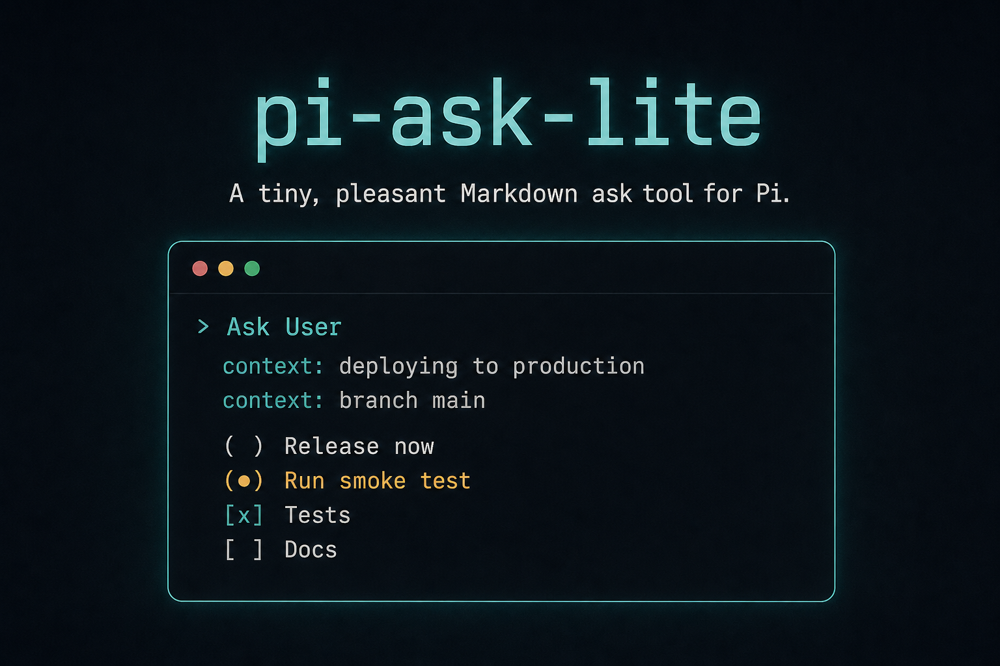

# pi-ask-lite



A tiny, pleasant Markdown ask tool for Pi.

`pi-ask-lite` is for both sides of an agent question:

- **Users** get a small terminal prompt when Pi needs a decision.
- **Agents** get a deliberately slim tool surface: one tool, one Markdown string, answer out.

No option arrays. No mode flags. No UI schema to construct. The Markdown prompt is the interface.

## Install

```bash
pi install npm:pi-ask-lite
```

## For users

Sometimes Pi needs input from you: choose one option, select several items, confirm a plan, or write a short answer.

`pi-ask-lite` turns that moment into a focused terminal UI instead of a long chat question. You can select options, edit the proposed answer, or write your own response.

Keyboard controls:

- `Space` selects or toggles the focused option.
- `Shift+Space` selects or toggles and marks the answer for editing.
- `Enter` sends a valid selection, or opens the selected answer as an editable draft when edit mode is active.
- `Esc` / `Ctrl+C` opens an empty free-text editor.

Direct selections return the selected Markdown structure. Free-text answers and edited drafts are returned unchanged.

## For agents

`pi-ask-lite` registers one tool: `ask`.

Input:

```ts
{
  markdown: string;
}
```

Pass one complete Markdown prompt. The user answers in the UI. The tool returns the final answer as Markdown/text.

Use `ask` when you need a real user decision and want the interaction to stay simple. Write the question in Markdown; use the lightweight conventions below for choices.

## Example

Prompt:

```md
Choose what to do next:

* The implementation is complete.
* Checks passed locally.

- Release now
- Run one more smoke test
- Make a small polish pass
```

Returned answer:

```md
- Run one more smoke test
```

## Markdown conventions

Use normal Markdown for explanation and a few lightweight conventions for choices.

### Context

Use `*` for non-interactive context bullets:

```md
Given:

* The implementation is complete.
* Checks passed locally.
```

### Single choice

Use plain list items:

```md
- Release now
- Run one more smoke test
- Make a small polish pass
```

### Multi choice

Use unchecked task items:

```md
- [ ] Tests
- [ ] Docs
- [ ] Release notes
```

Do not preselect options with `- [x]`. Express recommendations in normal Markdown text instead.

### Independent groups

Use headings to split independent required groups:

```md
## Target
- Production
- Staging

## Action
- Deploy
- Dry run
```

### Dependent subchoices

Indent child options below their parent:

```md
- [ ] Publish
    - npm only
    - npm and GitHub release
- [ ] Do not publish yet
```

## Development

Run locally:

```bash
pi --extension ./src/index.ts
```

Checks:

```bash
npm run check
npm test
npm run pack:dry
```

## License

MIT
